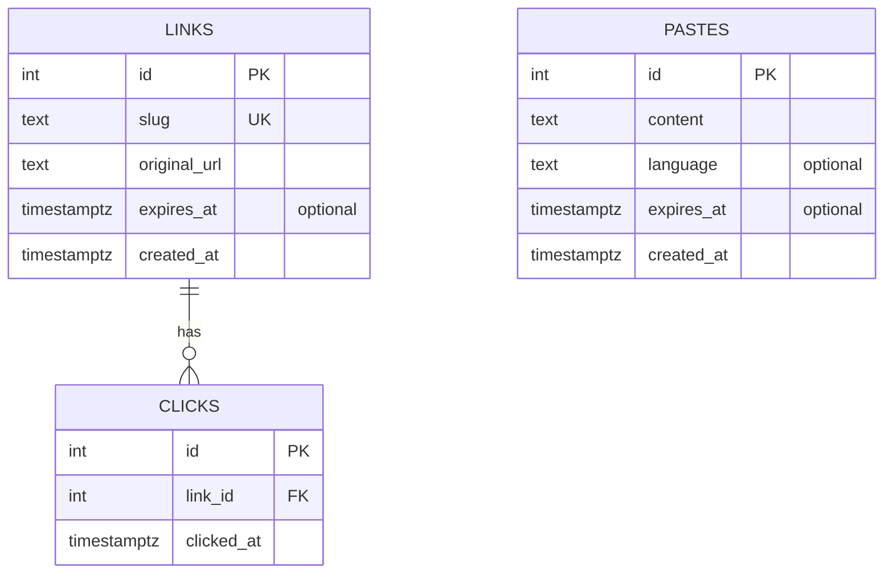

# Database diagram

```mermaid
erDiagram
  LINKS ||--o{ CLICKS : has
  LINKS {
    int id PK
    text slug UK
    text original_url
    timestamptz expires_at "optional"
    timestamptz created_at
  }
  CLICKS {
    int id PK
    int link_id FK
    timestamptz clicked_at
  }

  PASTES {
    int id PK
    text content
    text language "optional"
    timestamptz expires_at "optional"
    timestamptz created_at
  }
```
