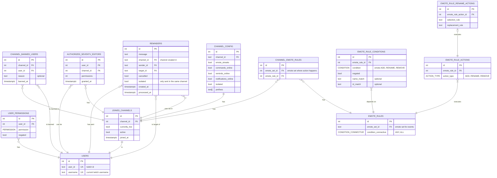

# Database diagram

## Emote rules

### Actions

- Add emote: by id
- Rename emotes: emotes matching [regex] renamed to [regex]
- Remove emote: by id or matching [regex]

### Examples

#### 1. Emote set synchronization
Condition: a certain user adds an emote in any channel the bot has eventsub on
Action: add the added emote to a certain emote set(s) by emote set id

#### 2. Emote name standardation
Condition: an emote is added to a specific channel
Action: rename it based on regex rule

#### 3. Emote blocking
Condition: an emote is added to a specific channel
Action: remove it

- channel has a rule
- rule can be subscribed to events for a certain channel
-
